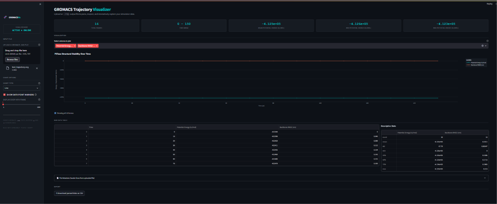

# gromacs-trajectory-visualizer

## Overview

**GROMACS Trajectory Visualizer** is an interactive Streamlit dashboard for parsing and analyzing GROMACS molecular dynamics simulation output files. Upload a `.xvg` trajectory file, and the app automatically extracts, parses, and visualizes your simulation data with an intuitive interface. Explore multiple data series, apply downsampling for large datasets, and export results as CSV—all without writing a single line of code.

## System Requirements

- **Python**: 3.8 or higher
- **Operating System**: Windows, macOS, or Linux
- **RAM**: Minimum 512 MB (recommended 2+ GB for large trajectories)
- **Disk Space**: ~500 MB for dependencies

## Quick Start Guide

Follow these steps to get the visualizer running on your machine:

### 1. Clone the Repository
```bash
git clone https://github.com/AyushmaanSingh941/gromacs-trajectory-visualizer.git
cd gromacs-trajectory-visualizer
```

### 2. Create a Virtual Environment (Recommended)
```bash
python -m venv venv
source venv/bin/activate        # On macOS/Linux
# or
venv\Scripts\activate           # On Windows
```

### 3. Install Dependencies
```bash
pip install -r requirements.txt
```

### 4. Run the Application
```bash
streamlit run app.py
```

Your browser will open to `http://localhost:8501` displaying the dashboard.

### 5. Upload and Analyze
- Click **"Upload a GROMACS .xvg file"** in the sidebar
- Select your `.xvg` or `.txt` trajectory file
- Use the **Chart Options** to customize visualization (Line/Scatter/Area, markers, downsampling)
- View statistics, raw data table, and export your parsed results as CSV

## Features

- ✨ **Instant Visualization**: Beautiful, interactive Plotly charts with dark theme
- 📊 **Multi-Series Support**: Plot multiple trajectories or energy components side-by-side
- 🎛️ **Real-Time Controls**: Toggle markers, switch chart types, downsample data for fast rendering
- 📋 **Data Export**: Download parsed data as CSV for external analysis
- 🧬 **GROMACS Native**: Automatically parses `@` and `#` header lines; supports standard `.xvg` format
- ⚡ **High Performance**: Vectorized parsing with NumPy for handling large files

## Demo

Below is an example of the dashboard analyzing a GROMACS trajectory:



> **Note**: To add a screenshot, run the app with a sample `.xvg` file, capture the dashboard, and save it as `docs/dashboard-demo.png` in the repository.

## Example Workflow

```bash
# With GROMACS installed, generate a sample energy file
gmx energy -f ener.edr -o energy.xvg

# Then visualize it
streamlit run app.py
# Upload energy.xvg → explore trajectories → export results
```

## Supported File Formats

- **`.xvg`** – Native GROMACS output (XMGrace format)
- **`.txt`** – Plain text with equivalent structure

### Expected File Structure
```
# GROMACS comment (starts with #)
@ xaxis label "Time (ps)"
@ yaxis label "Potential Energy (kJ/mol)"
@ s0 legend "Total"

0.00    -412345.678
0.01    -412300.123
0.02    -412280.456
```

## Dependencies

| Package  | Version | Purpose                          |
|----------|---------|----------------------------------|
| streamlit | 1.32.0  | Web app framework                |
| pandas   | 2.2.1   | Data manipulation & analysis     |
| numpy    | 1.26.4  | Numerical computing              |
| plotly   | 5.19.0  | Interactive visualization        |

## Troubleshooting

### "Module not found" errors
Ensure you've activated the virtual environment and installed dependencies:
```bash
source venv/bin/activate  # macOS/Linux
pip install -r requirements.txt
```

### Slow rendering with large files
Use the **"Display every Nth frame"** slider in the sidebar to downsample data. Set to 5 or higher for files with >50k frames.

### File upload fails
Verify your file is a valid `.xvg` or `.txt` with numeric data. Header lines must start with `#` or `@`.

## License

[Add your license here, e.g., MIT, GPL-3.0, etc.]

## Contributing

Contributions are welcome! Please:
1. Fork the repository
2. Create a feature branch (`git checkout -b feature/your-feature`)
3. Commit your changes (`git commit -m "Add your feature"`)
4. Push to the branch (`git push origin feature/your-feature`)
5. Open a Pull Request

## Contact & Support

For questions or issues, please open a [GitHub Issue](https://github.com/AyushmaanSingh941/gromacs-trajectory-visualizer/issues).

---

**Built with ❤️ for molecular dynamics visualization**
